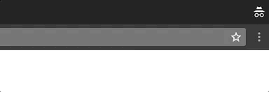

# timesheet_nags
[](https://badge.fury.io/rb/timesheet_nags)
[](https://travis-ci.org/github/dpritchett/timesheet_nags)

Goal: To remind you daily when your timesheet is out of date.

Requirements: 

- [Harvest API credentials](https://id.getharvest.com/developers)
- OSX Sierra and up
- Ruby 2.2 - 2.7




## Usage

* `gem install timesheet_nags`
* Run `timesheet_nags` to get a live check - it'll annoy you if you haven't updated your timesheet in over a day (and today's not Monday).


### Scheduling

I'm using a crontab.  Run `crontab -e` and then paste this in, save, and exit. Note that I used the full path to my executable, which in my case is in an `asdf` folder somewhere.

```sh
HARVEST_TOKEN='redacted'
HARVEST_ACCOUNT_ID='redacted'

# timesheet nags at 10 and 4
0 10 * * * /Users/daniel/.asdf/shims/timesheet_nag >>/tmp/stdout.log 2>>/tmp/stderr.log
0 16 * * * /Users/daniel/.asdf/shims/timesheet_nag >>/tmp/stdout.log 2>>/tmp/stderr.log
```


## Future possibilities

- More nag configuration
- Support backends other than Harvest and OSX growl


TODO: Delete this and the text above, and describe your gem

## Development

After checking out the repo, run `bin/setup` to install dependencies. Then, run `rake test` to run the tests. You can also run `bin/console` for an interactive prompt that will allow you to experiment.

To install this gem onto your local machine, run `bundle exec rake install`. To release a new version, update the version number in `version.rb`, and then run `bundle exec rake release`, which will create a git tag for the version, push git commits and tags, and push the `.gem` file to [rubygems.org](https://rubygems.org).

## Contributing

Bug reports and pull requests are welcome on GitHub at https://github.com/dpritchett/timesheet_nags. This project is intended to be a safe, welcoming space for collaboration, and contributors are expected to adhere to the [Contributor Covenant](http://contributor-covenant.org) code of conduct.

## License

The gem is available as open source under the terms of the [MIT License](http://opensource.org/licenses/MIT).

## Code of Conduct

Everyone interacting in the TimesheetNags project’s codebases, issue trackers, chat rooms and mailing lists is expected to follow the [code of conduct](https://github.com/dpritchett/timesheet_nags/blob/master/CODE_OF_CONDUCT.md).
